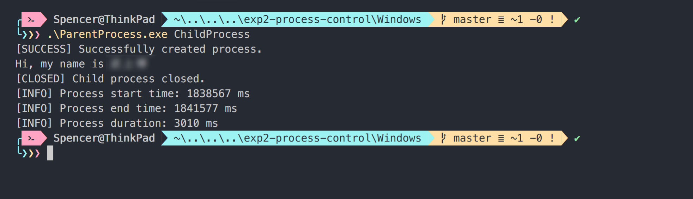
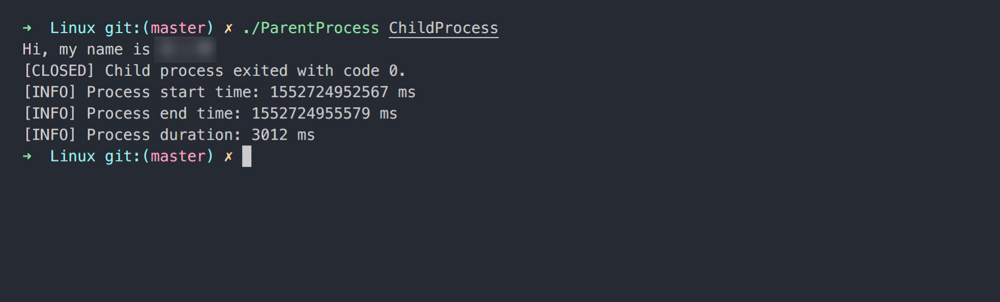

# 实验二、进程控制

设计并实现 Windows 和 Linux 的 "ParentProcess” 命令。"ParentProcess” 命令通过命令行参数接受要运行的程序，创建一个独立的进程来运行该程序，并记录程序运行的时间。

## 在 Windows 下实现:

- 使用 CreateProcess() 来创建进程
- 使用 WaitForSingleObject() 在 "ParentProcess” 命令和新创建的进程之间同步
- 调用 GetSystemTime() 来获取时间

## 在Linux下实现:

- 使用 fork()/execv() 来创建进程运行程序
- 使用 wait() 等待新创建的进程结束
- 调用 gettimeofday() 来获取时间

## 要求：

- 父进程：
  - 名称：ParentProcess(.exe)
  - 功能：启动 ChildProcess(.exe)
  - 打印子进程开始时间，结束时间，耗时。精确到毫秒
- 子进程：
  - 名称：ChildProcess(.exe)
  - 功能：打印「Hi，my name is + 你的名字」
  - 延时 3s

## ParentProcess的用法：

### Windows

```powershell
$ .\ParentProcess.exe ChildProcess
```



### Linux

```bash
$ ./ParentProcess ChildProcess
```


